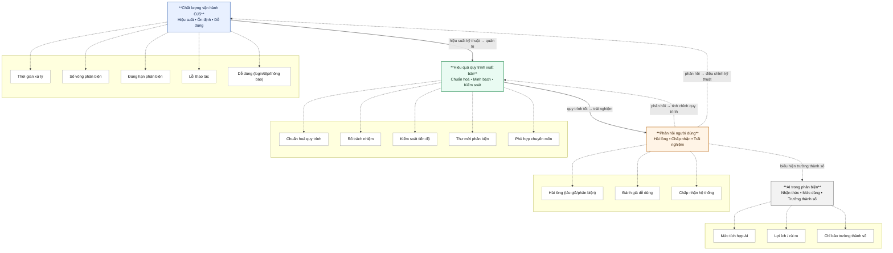

# OJS
Journals using OJS in Vietnam

## Hình 2.5 – Sơ đồ khung khái niệm

```mermaid
flowchart TB
%% ================== STYLES ==================
classDef core1 fill:#E8F0FF,stroke:#2F5FB3,stroke-width:1.5px,color:#0B1F44;
classDef core2 fill:#E9FBF2,stroke:#1F8A4C,stroke-width:1.5px,color:#0B2B18;
classDef core3 fill:#FFF4E6,stroke:#B35C00,stroke-width:1.5px,color:#3A1E00;
classDef sub fill:#FFFFFF,stroke:#999,stroke-width:1px,color:#111;
classDef branch fill:#F2F2F2,stroke:#666,stroke-width:1.2px,color:#111;

linkStyle default stroke:#444,stroke-width:1.4px;

%% ================== CORE NODES ==================
A["**Chất lượng vận hành OJS**<br/>Hiệu suất • Ổn định • Dễ dùng"]
B["**Hiệu quả quy trình xuất bản**<br/>Chuẩn hoá • Minh bạch • Kiểm soát"]
C["**Phản hồi người dùng**<br/>Hài lòng • Chấp nhận • Trải nghiệm"]
D["**AI trong phản biện**<br/>Nhận thức • Mức dùng • Trưởng thành số"]

class A core1;
class B core2;
class C core3;
class D branch;

%% ================== SUB NODES (INDICATORS) ==================
subgraph SA[" "]
direction TB
A1["Thời gian xử lý"]:::sub
A2["Số vòng phản biện"]:::sub
A3["Đúng hạn phản biện"]:::sub
A4["Lỗi thao tác"]:::sub
A5["Dễ dùng (login/tệp/thông báo)"]:::sub
end

subgraph SB[" "]
direction TB
B1["Chuẩn hoá quy trình"]:::sub
B2["Rõ trách nhiệm"]:::sub
B3["Kiểm soát tiến độ"]:::sub
B4["Thư mời phản biện"]:::sub
B5["Phù hợp chuyên môn"]:::sub
end

subgraph SC[" "]
direction TB
C1["Hài lòng (tác giả/phản biện)"]:::sub
C2["Đánh giá dễ dùng"]:::sub
C3["Chấp nhận hệ thống"]:::sub
end

subgraph SD[" "]
direction TB
D1["Mức tích hợp AI"]:::sub
D2["Lợi ích / rủi ro"]:::sub
D3["Chỉ báo trưởng thành số"]:::sub
end

%% Attach subnodes to cores (dotted, nhẹ mắt)
A -.-> A1
A -.-> A2
A -.-> A3
A -.-> A4
A -.-> A5

B -.-> B1
B -.-> B2
B -.-> B3
B -.-> B4
B -.-> B5

C -.-> C1
C -.-> C2
C -.-> C3

D -.-> D1
D -.-> D2
D -.-> D3

%% ================== MAIN FLOWS ==================
A -->|"hiệu suất kỹ thuật → quản trị"| B
B -->|"quy trình tốt → trải nghiệm"| C
C -.->|"biểu hiện trưởng thành số"| D

%% Feedback loops
C -.->|"phản hồi → điều chỉnh kỹ thuật"| A
C -.->|"phản hồi → tinh chỉnh quy trình"| B
```
